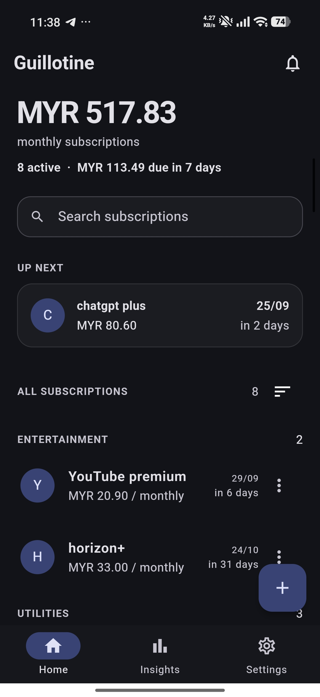
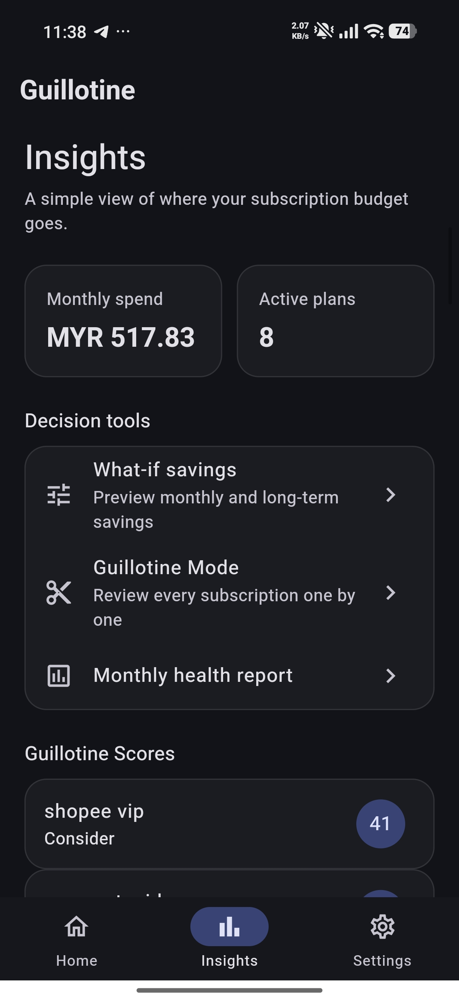
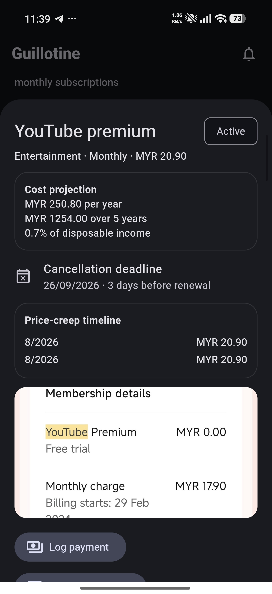
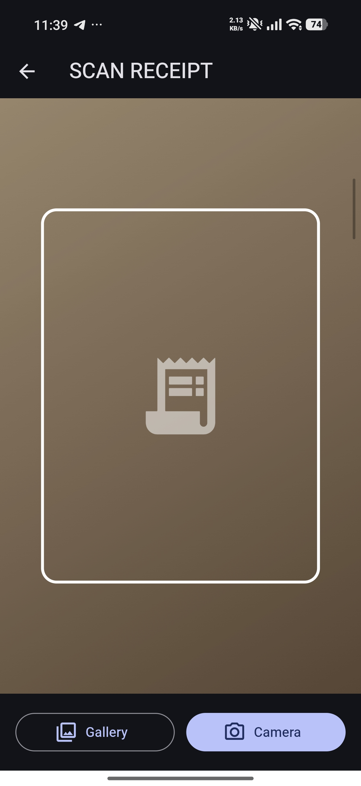
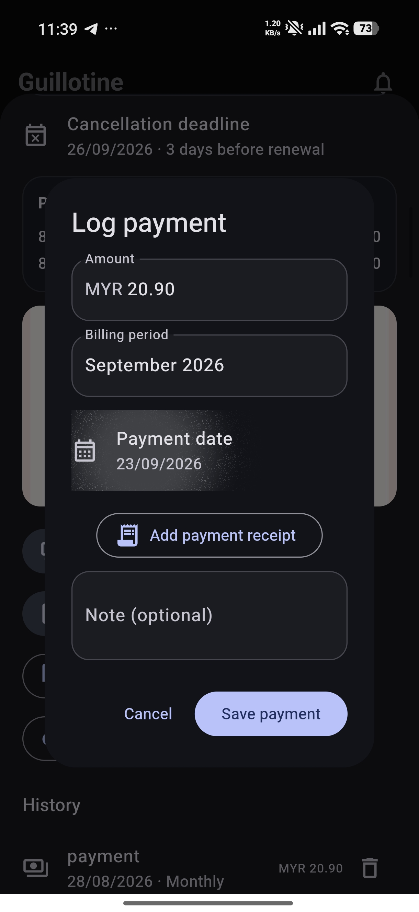
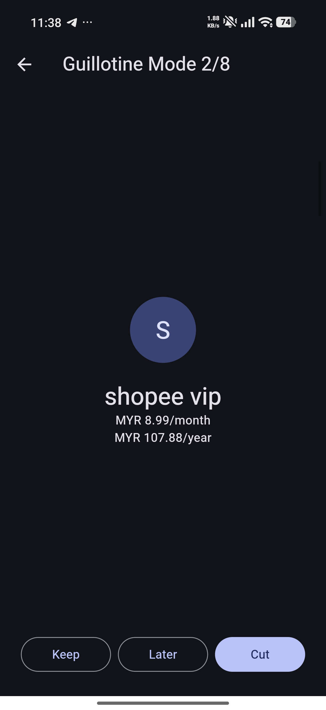

# Subscription Guillotine

**Track renewals. Understand the cost. Cut what you don't need.**

Subscription Guillotine is an offline-first Flutter app for tracking recurring
payments and evaluating their effect on a personal budget. It combines on-device
receipt recognition, renewal reminders, spending insights, cancellation tools,
and explainable recommendations without requiring an account or cloud service.

## Screenshots

<table>
  <tr>
    <td align="center"><strong>Dashboard</strong></td>
    <td align="center"><strong>Insights</strong></td>
    <td align="center"><strong>Subscription details</strong></td>
  </tr>
  <tr>
    <td></td>
    <td></td>
    <td></td>
  </tr>
  <tr>
    <td align="center"><strong>Receipt scanning</strong></td>
    <td align="center"><strong>Payment logging</strong></td>
    <td align="center"><strong>Guillotine Mode</strong></td>
  </tr>
  <tr>
    <td></td>
    <td></td>
    <td></td>
  </tr>
</table>

## Highlights

### Subscription tracking

- Daily, weekly, monthly, and yearly billing cycles
- Categories, trial dates, renewal reminders, and permanent receipt attachments
- Active, planning-to-cancel, cancellation-requested, and cancelled states
- Payment, price-change, and status history
- Monthly payment receipts with offline charge auditing and duplicate detection
- Search and dashboard sorting by next billing date or category

### Receipt intelligence

- Camera and gallery input
- Local Google ML Kit text recognition
- Suggested merchant, price, billing date, recurrence, and category
- Detection of trial, recurring-payment, discount, and tax wording
- Editable confirmation form when OCR results are missing or inaccurate
- Receipt-to-subscription checks for price and merchant mismatches
- Explainable price-change alerts with an option to accept a verified new price

### Financial decision tools

- Optional local financial profile with income, essential commitments, and a
  target subscription budget
- Subscription burden against estimated disposable income
- Explainable Guillotine Score with visible point-by-point reasons
- Editable essential and usage signals
- Same-category overlap detection
- What-if monthly, yearly, and five-year savings simulator
- Focused Guillotine Mode for Keep, Later, or Cut decisions
- Monthly subscription health report
- One-year and five-year cost projections
- Renewal value check-ins that refresh the usage signal used by the score
- Per-subscription price-creep timeline and annual impact

### Cancellation and savings

- Cancellation URL, notes, reference, date, and confirmation proof
- Prepared cancellation message that can be copied
- Cancelled-subscription history and monthly savings calculation
- Direct access to supported cancellation websites
- Configurable last-safe cancellation deadlines and local alerts
- Multi-entry cancellation evidence vault for screenshots and references

### Reminders and widgets

- Local renewal and trial-expiration notifications
- Configurable reminder lead time and delivery time
- Notification master switch and test action
- Reminder screen ordered by urgency
- Android home-screen widget showing monthly spend, active count, and next charge

### Data ownership

- Local SQLite persistence
- CSV export
- Password-encrypted AES-256-GCM backup and restore
- Light and dark themes that follow the device setting

## Privacy

Subscription records, financial-profile values, attachments, and OCR processing
remain on the device. Receipt images are processed locally and are not uploaded
to an external recognition service. Financial-profile values are excluded from
CSV exports.

## Technology

- Flutter and Material 3
- Riverpod ViewModels (`AsyncNotifier` and `StateNotifier`)
- `sqflite`
- `google_mlkit_text_recognition`
- `flutter_local_notifications` and `timezone`
- `home_widget` with a native Android widget provider
- `cryptography` for encrypted backups

## Run the Project

```sh
flutter pub get
flutter run
```

To build Android APKs:

```sh
flutter build apk --debug
flutter build apk --release
```

Camera, gallery, and notification permissions are requested only when their
related features are used. After installation, the Android summary widget can
be added from the launcher's **Widgets** menu.

## Release note

The checked-in Android release configuration currently uses the debug signing
key for local testing. Configure a private release keystore before publishing
the app to Google Play.
